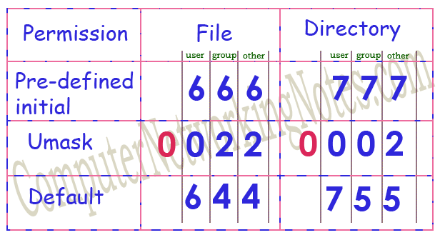
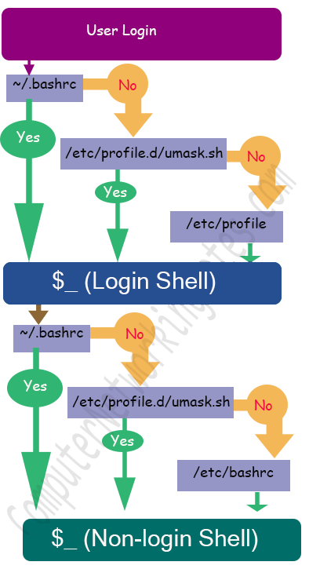

# Linux Umask

Linux系统里面，每个文件或目录都具有如下三种访问权限：

- 读权限
- 写权限
- 执行权限

除此之外，文件或目录的权限还针对三种不同的类型的群组：

- owner: 文件所有者
- group: 文件所在群组
- other: 其他用户

我们可以针对不同群组用户给文件或目录设定不同的访问权限。

> umask (user mask) is a command and a function in POSIX environments that sets the file mode creation mask of the current process which limits the permission modes for files and directories created by the process. A process may change the file mode creation mask with umask and the new value is inherited by child processes.

umask，user mask，用户权限掩码，它的作用就是在用户创建文件或目录的时候，会根据当前用户的用户权限掩码为文件设定默认的访问权限。

访问权限的计算规则：

`Default permission` = `pre-defined initial permission` – `umask permission`

- The pre-defined initial permissions for files and directories are **666** and **777** respectively.
- The default umask permissions for root user and remaining users are **0022** and **0002** respectively.
- The pre-defined initial permissions are fixed and cannot be changed. The default umask permissions are flexible and can be updated as per requirement.
- Umask permissions are also known as umask values or umask setting. All these words (umask permissions, umask values and umask setting) are used to represent the four numeric variables which are used to calculate the default permissions.

> First bit (0) in default umask values represents a special permission (SUID, SGID or Sticky bit) which cannot be affected by umask. Since umask cannot affect this permission, it always uses a value zero (0) as the placeholder value in this field. A value zero (0) means, ignore it while calculating the default permissions. 

> **Login shell:**
>
> This is the shell environment which user receives just after the login. It provides a customized interface to interact with system. It takes input command from user and display the result on standard output device. The command prompt which user receives just after the login is example of login shell.

> **Non-login shell:**
>
> This is the additional Shell interface which user accesses from login shell to perform a specific task. **Since it is accessed from a login shell, it inherits all customized properties of parent (logged in) shell**. But at the same time it is also a separate shell which allows us to override the default properties. Any terminal which we open in GUI to execute the command is the example of non-login shell.

Based on targeted user and shell access type, permanent umask setting can be configured in four files.

| Configuration file |	Type of setting	|Targeted user|	When applied|	Shell access type |
| --- | --- | --- | --- | --- |
| /etc/profile |	Default setting |	All users including root |	While user login |	Login shell |
| /etc/bashrc |	Default setting |	All users including root |	While user access additional shell |	Non-login shell |
| /etc/profile.d/umask.sh |	Custom setting |	All users including root |	While user login and while user access additional shell. |	Both Login shell and non-login shell |
| /home/[user-name]/.bashrc |	Custom setting |	Individual user |	While individual user login and access additional shell |	Both Login shell and non-login shell |

### 参考资源

[How to change Default Umask Permission in Linux](https://www.computernetworkingnotes.com/rhce-study-guide/how-to-change-default-umask-permission-in-linux.html)

